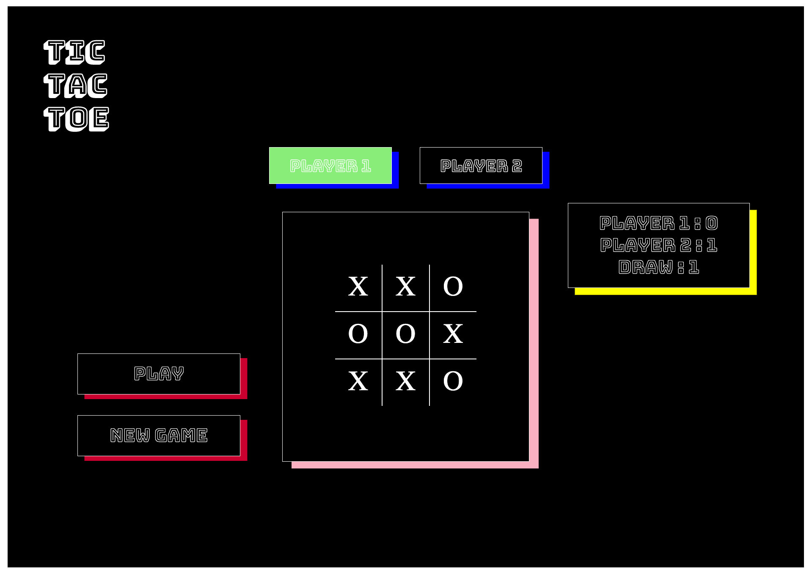
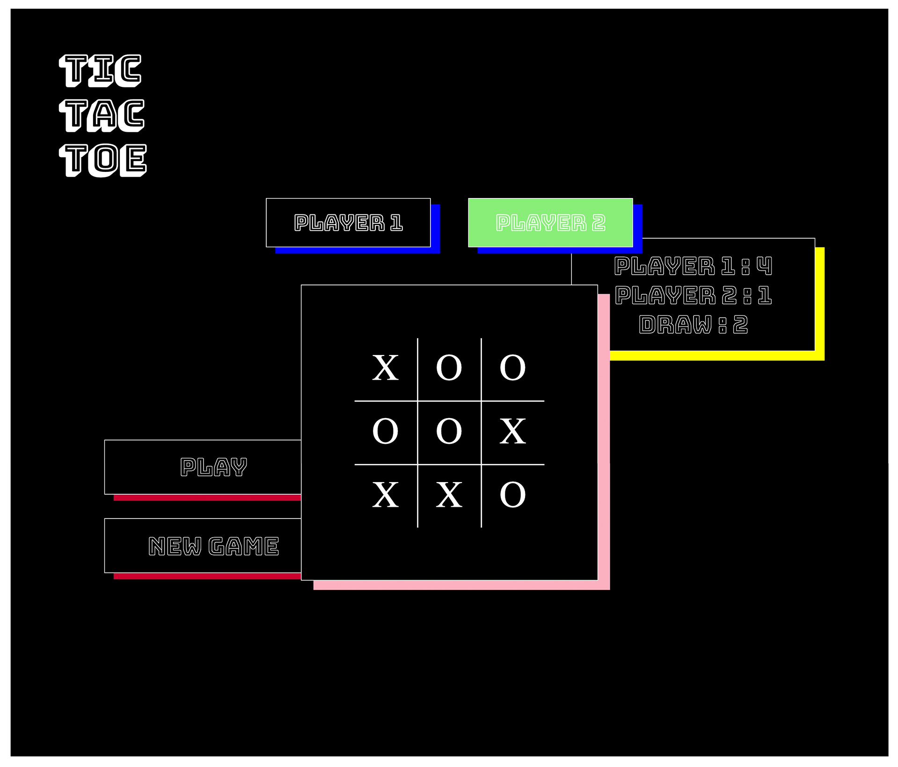

TIC-TAC-TOE
=============

## Summary

Tic-tac-toe is the first individual project, where we implement HTML, CSS, Javascript and jQuery. The game proposal requires two players of noughts (O) and crosses (X) - or other player features. The aim of the game is for players to connect a row of three, within the nine available winning combinations by taking turns. The project outcome requires to create and map out the game logic, create sperate HTML, CSS, and js files, and craft a readme.md file. Technical requirements are to program the game, so the players switch turns, rendering a board for players to place their mark on the browser, visual display of keeping score, DOM manipulation on Javascript, and deploy the game online.

## Key functionalities

Two-player functionality to take turns.
'Draw' functionality for when the game board meets full capacity with no winners.
'Play' functionality to clear the board and continue the game count.
'New Game' functionality to clear board/scoreboard and restart the full game.

## Design Layout - CSS, HTML, Javascript, jQuery

The aim for my overall layout was to design a simple yet aesthetically pleasing game. Tic-tac-toe is an easy and simple game, so my goal was to enhance the design for a new experience. I experimented with event-listeners and methods to draw attention to critical features such as enlarging buttons with hover effects, switching player icon colors and flipping game board as it resets. For visual aspect, I added colored box-shadows to create a 3D effect that pops out from a simple background render. During the process, I stumbled upon the difficulties of keeping the elements in place. See images below...





The bug can be resolved with a `max-width` in the css container class.

## Functionality and Features

* Clicks on players turn places player icon.
* Box click disables once a box is taken.
* Board is disabled once a player wins a round by matching a winning combination.
* Winner's score or draw count displayed on score-board.
* Play button clears board for new round.
* New game button resets full game - scoreboard back to 0 and clear board.
* Play and New Game button clears board with a flip-box functionality

## Bugs, bugs, and more bugs

I stumbled upon a lot of bugs on the way for creating this exciting, fun amazing game... The main a repeated problem was repeating a lot of lines and not using methods in the correct manner. As an example of the many, I had used ```.addclass('flip-board')``` which only worked once. Another issue with this function was, I had a repeating function for ```$('#newgame').on('click', function ()``` which did not allow me to continuously flip the board once the button had been clicked. This was resolved by using the ```.toggleClass()``` method and by deleting the repeated function. See below :

```  
    $('#newgame').on('click', function () {
    $('.box').removeClass('X O').empty();
    $('#main-gameboard').toggleClass('flip-board');
```

To be continued with more bugs I found along the way...

## Future Improvements

Keeping my code DRY is the key skill for me to practice more often. Moving forward, I aim to continue on with this project as I get better with Javascript, jQuery and CSS. Also, naming variables in a proper manner is essential and something I need to work on more as I progress through the course.

## Live Game

Tic-tac-toe: https://sarahhae.github.io/ubiquitous-tictactoe/
